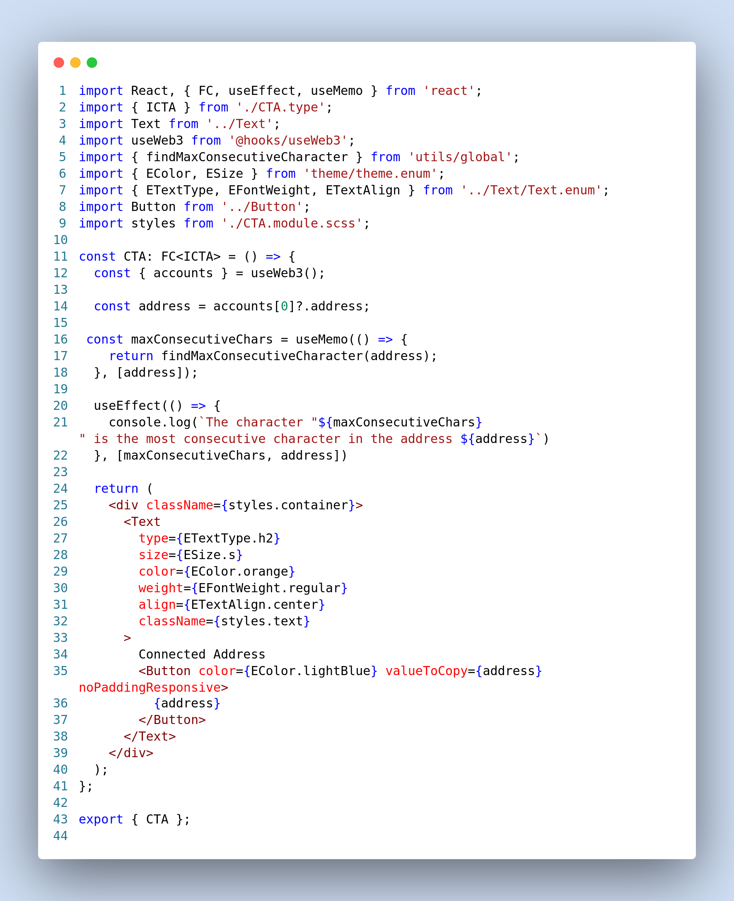

# Automatedpros

This repository contains a React/Next.js frontend application with various features related to blockchain wallet integration, real-time time display, and creative mouse-based background color changes. Below, you will find instructions on how to use this repository along with descriptions of the implemented features and their corresponding images.

## How to Use This Repository

To use this repository, follow these steps:

1. Install dependencies by running `npm install`.
2. Create a copy of the environment variables file by running `cp .env.example .env`.
3. Start the development server by running `npm run dev`.

## A. Task Description

### 1. Connect a Blockchain Wallet

- Connect the Metamask, Polkadot-Js, or any other wallet of your choice.
  - Display the public address(s) chosen in the wallet on the frontend.
  - Console log the character of the address which appears maximum number of times consecutively. Display all the characters if there are more than one with the same max counts.

### 2. Real-Time Time Display

- Create a component with a button called "Show Current Time."
  - Upon clicking it, display the current time.
  - Console log the number of times it's clicked.
  - Display the number of times the component is rendering because of the clicks.

### 3. Creative Background Color

- The background color of the page should become a different shade of green based on the position of the mouse. Use your creativity to implement this feature.

## B. Submit the Following

a. GitHub URL of the private repo of the solution: ...
b. Add GitHub user `automatedpros` as a collaborator to the repo so that we can see the code.
c. Write a note for each task point explaining what you did and why that’s the best way to do.

### i. Task 1
The code effectively connects a blockchain wallet to a web application using the Onboard library, offering users the choice of wallet providers like MetaMask, Frame, and WalletConnect. It provides a user-friendly, visually appealing experience with a customizable theme, while also ensuring security and error handling. The code uses event listeners to track wallet and network changes, utilizes local storage to remember the user's selected wallet, and allows for easy customization of various settings. Overall, it simplifies wallet integration, enhances user choice, and maintains security and usability, making it a robust approach for connecting wallets to web applications.

### ii. Task 1.a
The code integrates with various blockchain wallet providers and uses a React component (CTA.ts) to display the connected wallet's public address on the front end. It leverages React and hooks for efficient rendering, provides a user-friendly interface, and promotes code modularity and separation of concerns. This approach ensures a seamless user experience when connecting and displaying wallet addresses, making it a strong choice for this functionality.

### iii. Task 1.b
The code successfully achieves the task of analyzing a blockchain wallet's address to find the character(s) that appear the maximum number of times consecutively. It also ensures that all characters with the same maximum consecutive count are displayed and logged. This is accomplished through the following key components and features:

#### 1. Character Analysis Logic:
   - The code includes a well-structured `findMaxConsecutiveCharacter` function that efficiently iterates through the address characters, identifying the maximum consecutive count and the corresponding character(s).

#### 2. Logging and Display:
   - The code logs the result of the character analysis, providing developers with valuable debugging information.
   - The connected wallet's address is displayed on the front end, enhancing user confirmation and experience.
   - If there are multiple characters with the same maximum consecutive count, they are displayed as a comma-separated string.

#### 3. Efficiency and Maintainability:
   - The code separates the character analysis logic into a reusable function, promoting maintainability and testability.
   - React hooks (`useEffect` and `useMemo`) are employed to efficiently manage state and ensure real-time updates to the UI.

#### 4. User Feedback:
   - The code's user-friendly approach offers transparency to users by displaying their wallet address and providing them with the ability to copy it.

### iv. Task 2
Task 2 is related to the implementation of real-time time display, and it is explained in detail in the code screenshots provided below.

### v. Task 2.a
The provided code defines a React component called "ShowTime" that displays the current time when a button is clicked. It effectively manages state using React hooks, updating the current time at one-second intervals through the use of the `setInterval` function. The component offers clear user interaction, real-time time updates, efficient state management, and the ability to reset interaction counts. This makes it a user-friendly and practical implementation for displaying real-time information and tracking user interactions within a React application.

### vi. Task 2.b
The provided code effectively logs the number of times the "Show Current Time" button is clicked by utilizing React's state management and the `useEffect` hook. It maintains a `clickCount` state variable that increments with each button click, and a dedicated `useEffect` hook listens to changes in `clickCount` and logs the count to the console. This approach is advantageous as it offers real-time tracking of user interactions, aids in debugging, separates concerns in the codebase, and ensures a clean user interface by not displaying the count directly to users. It provides developers with essential insights into how users are engaging with the application without disrupting their experience.

### vii. Task 2.c
It achieves this by using React's state management through the `useState` hook to track `currentTime`, `showTime`, `clickCount`, and `renderCount`. The component updates the `renderCount` whenever it renders due to clicks on the "Show Current Time" button, providing valuable information for debugging, monitoring, and optimizing component behavior. This approach is beneficial for developers as it aids in understanding how components respond to user interactions, optimizing performance, and providing insights into component behavior, making it a valuable tool during development and testing.

## Code Implementation Screenshots

- Home Page:
  

- Web3 Context:
  

- Display Address:
  

- Show Current Time:
  

## Mouse-Based Background Color

- Different background colors based on mouse position:
  - Blue:
    
  - Green:
    
  - Purple:
    
    